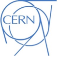
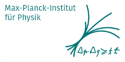

# Indico Governance

This repository provides the most up-to-date information on Indico's Governance structure.

## Roles

### Community Manager

Beatriz Medina - **Unconventional**

### Project Manager

Adrian Mönnich - **CERN**

### Product Manager

Pedro Ferreira - **CERN**

## Bodies

### Consultative Board

#### Project Representatives

- Project Manager - Adrian Mönnich - **CERN**
- Community Manager - Beatriz Medina - **Unconventional**
- Product Manager - Pedro Ferreira - **CERN**

#### Partner Organizations

- Andrii Verbytskyi - **MPP - Max-Planck Institute for Physics**
- Frank Moser - **UNOG - United Nations Office in Geneva**

  

#### Also invited to the board

- Community Manager - Bea Medina - **Unconventional**

### Participating Organizations

*Expressions of interest welcome!*

## Meetings

All Governance meetings are documented in the [corresponding Indico category on the CERN server](https://indico.cern.ch/category/17857/).
