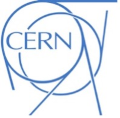
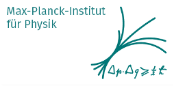
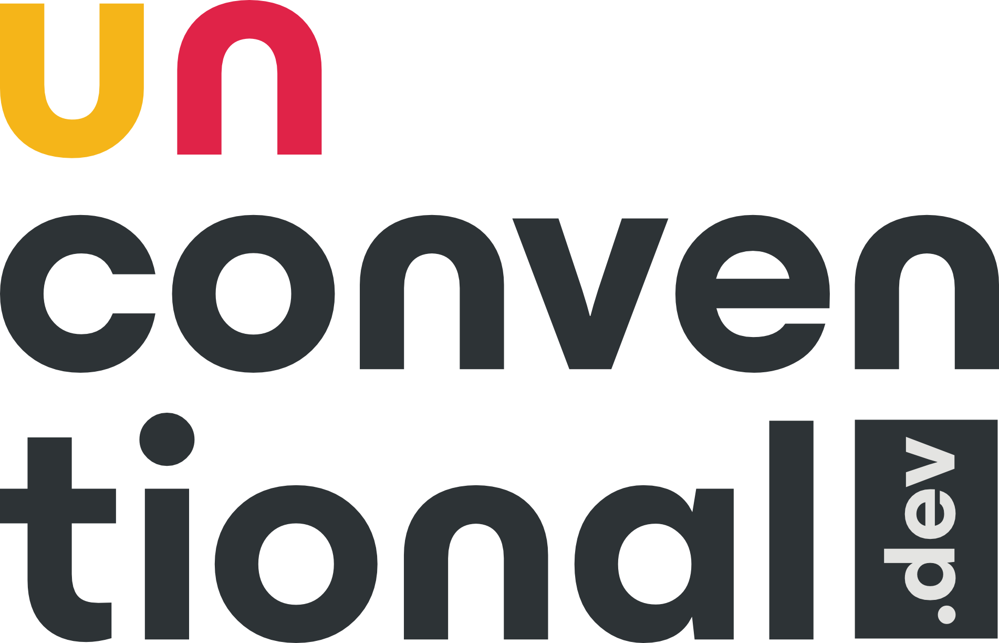

# Indico Governance

This repository provides the most up-to-date information on Indico's Governance structure.

## Roles

### Community Manager

Barbara Behrend - **Mainz Institute for Theoretical Physics (MITP)**

### Project Manager

Adrian Mönnich - **CERN**

### Product Manager

Thomas Baron - **CERN**

## Bodies

### Consultative Board

#### Project Representatives

- Project Manager - Adrian Mönnich - **CERN**
- Community Manager - Barbara Behrend - **Mainz Institute for Theoretical Physics (MITP)**
- Product Manager - Thomas Baron - **CERN**

#### Partner Organizations

- Andrii Verbytskyi - **MPP - Max-Planck Institute for Physics**
- Denis Dominguez - **UNOG - United Nations Office in Geneva**
- Alejandro Avilés - **UNCONVENTIONAL**

   

### Participating Organizations

*Expressions of interest welcome!*

## Meetings

All Governance meetings are documented in the [corresponding Indico category on the CERN server](https://indico.cern.ch/category/17857/).
