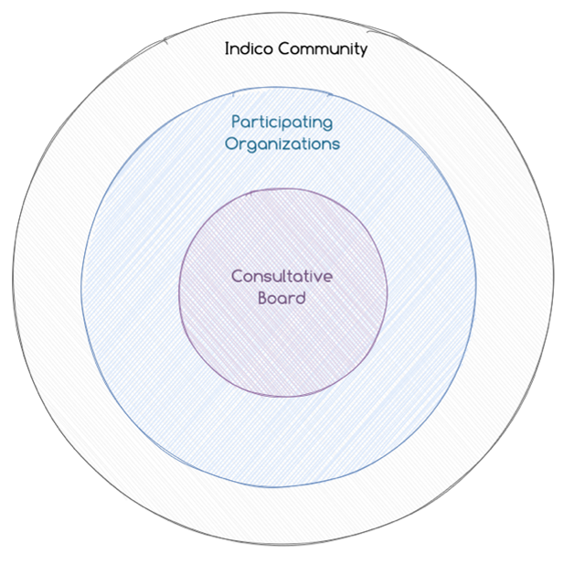

# 

# Governance Policy

*Version 1 — June 2023 — the Indico Community*

## Principles and Purpose

Indico is an open-source Project which aims to **simplify the
management, discovery and archival of meetings and conferences** using
web-based technologies.

Its key principles are:

-   **User Experience** - Indico aims to provide its users
    with **modern**, **intuitive** and **accessible** interfaces as well
    as with the best experience possible;

-   **Universality** - Indico is a **general-purpose** event management
    tool which shall target as much as possible generic workflows and a
    feature set which is useful to the majority of its users;

-   **Extensibility** - Indico provides a powerful set of programmatic
    and web APIs which allows plugins and applications to **extend its
    functionality** further.

## Community

In its **broader sense**, the **Indico Community** consists of everyone
involved in using Indico and advancing its development. That includes
developers, designers, translators, writers, system administrators, and
end users, among others.

The **Indico Community**, in its **narrower sense**, and **as meant in
this document** unless noted, consists of the set of institutions which
run an Indico service. They may choose to be identified as such
by **registering** in the **Indico Community Registry**.

### Indico Community Registry

The **Indico Community Registry** is a curated list of partner Indico
sites who explicitly accept to be directly contacted by the Indico Team
for community-coordination purposes. This includes:

-   in the event of **critical software vulnerabilities** which require
    immediate patching;

-   community-related **surveys** and **initiatives**.

## Governance

Indico is a **community-driven effort**, governed by **CERN** for the
benefit of the **Indico Community** in its broader sense. CERN strives
to make Indico a collaborative, open and transparent project to ensure
that everyone can contribute to and have their say regarding the
direction the Project takes. Indico's governance model was designed to
be lightweight and aims to strike a balance between agreed-upon
processes and standards as well as individual motivations. The
governance model is intended to enable participants to take
on **progressively larger and larger responsibility** with support from
the leadership.

This document defines different project roles and responsibilities,
while establishing the decision-making process, and defines how people
are appointed to the corresponding roles. Adherence to Indico's [Code of
Conduct](https://github.com/indico/indico/blob/master/CODE_OF_CONDUCT.md) is
required from all involved parties.

### Participating Organisations

Indico welcomes the engagement of **Participating Organisations**.
Participating Organisations have a direct interest in advancing the open
collaborative principles of the Indico community or related activities.
Participating Organisations are a subset of the **Indico Community** and
will be recognised on the [Indico website](https://getindico.io/).
Participating Organisations contribute actively and significantly to the
Indico project through code contributions, translations, community
animation or public outreach.

Participating Organisations must make an upfront commitment and confirm
their participation on an annual basis through an annual report and
attendance at an annual **Community Meeting** either in-person or
virtually.

Any requests to become a **Participating Organization** shall be
addressed to the Product, Project or Community Manager and require the
approval of the **Consultative Board**.

### Consultative Board

The **Consultative Board** is made up of representatives of institutions
that make contributions of particular relevance to Indico. Such
contributions can include **code**, **support materials**, **community
building**, **direct contributions of financial support** to the
project, and much more. Membership of the **Consultative Board** is
obtained through invitation by CERN, among the personnel of the
Participating Organisations, for **terms of two years**. Members of the
Consultative Board are appointed directly - this means that in the event
of an early departure from a role, there is no automatic replacement,
and the appointment of a new member will be at CERN's initiative.

The Consultative Board is **chaired by the Product Manager, or in their
absence, the Project Manager**, who, together with the **Community
Manager**, are members of the board as well. Members of the same
institution have the right to one single vote (i.e., maximum one vote
per organisation).

The Consultative Board is a **consultative** body which provides advice
to the Project and helps identify **strategic and community
priorities**. The board will meet **twice per year**, in person or
remotely. The latter may be called upon by the **Project or the Product
Manager** on an ad-hoc basis, should the need arise.

### Evaluation

This Governance Policy is open to re-evaluation by the community,
through its bodies and roles, at any time. Any changes to this Policy
will require the approval of the Consultative Board and are subject to
the veto conditions outlined in the section "Decision Making" below.

## Roles and Responsibilities

The **Project Manager**, **Product Manager** and **Community
Manager** make up the leadership of the Indico Community.

### Roles

-   **Community Manager**

    -   Appointed by the Consultative Board upon recommendation by any
        of the members (2-year term);

    -   Responsible for the community-based aspects of Indico, including the
        organisation of the Indico workshops, management of community-oriented
        tools and identification of synergies across sites.

-   **Product Manager**

    -   Appointed by CERN;

    -   Responsible for Indico's overall vision and strategy as a
        software product as well as the evolution of its feature set, in
        Coordination with the Project Manager and the Consultative
        Board.

-   **Project Manager**

    -   Appointed by CERN;

    -   Responsible for the day-to-day management of Indico's core
        application and plugins, as well as coordination of developments
        across the Indico Community in all its development sites.

-   **Consultative Board Member**

    -   Appointed by the participating organisation (itself appointed by
        CERN based on its recent contributions within the Project, on a
        2-year term);

    -   Responsible for representing that organisation on the
        Consultative Board, by providing advice to the Project and
        helping to identify strategic and community priorities.

## Role Revocations

The Product Manager may revoke appointed roles of a member for reasons
such as (but not limited to):

-   lack of activity and/or lack of meaningful contributions;

-   violations to the code of conduct;

-   repeated infringements of the contribution guidelines for the
    Project.

The Product Manager must give a warning to the member to allow them to
correct their behaviour except in severe cases. Revoking roles should be
a last resort measure, and only serve the purpose of ensuring that
Indico has a healthy community and collaboration based on its Code of
Conduct.

## Meetings and Events

-   The **Consultative Board** should meet **at least twice a
    year** either in person or remotely. The **Project or Product
    Manager** shall chair the board and are also entitled to call for an
    ad-hoc Consultative Board meeting if needed;

-   The **Indico Workshop**, whose aim is to foster exchange and present
    advances of the product to the broader community, shall take
    place **at least once every two years** (in person if possible, with
    remote attendance possible) and shall be organized by
    the **Community Manager** with the help of a **Host
    Organisation** approved by the Consultative Board;

-   A **Community Meeting** shall be organized **yearly**, at the same
    time as the Workshop if there is one that year, either in person or
    remotely. In it, **Participating Organizations** shall provide
    updates on their sites and any developments made. The **Community
    Manager** shall chair this meeting.

## Decision Making

The aforementioned bodies are tasked with the following decisions:

-   **Approving the road map** for the following year, as proposed by
    the development team - last **Consultative Board** of the year;

-   Deciding on the date and location of the **Indico
    Workshop** - **Community Meeting**;

-   Agreeing on the allocation of resources from Participating
    Organisations to the Project, as well as the organisation of Project
    outreach activities - **Community Meeting**.

**Consensus** should be always sought in all formal and informal
processes. If no consensus arises, a simple majority vote should be
held. **The Project Leadership** (represented by the Project and Product
Managers) has the **power to veto any decision**. All such vetoes can
be **challenged** by escalation to the corresponding CERN hierarchy, who
should seek the advice of the various members of the **Consultative
Board** before taking a final decision.
